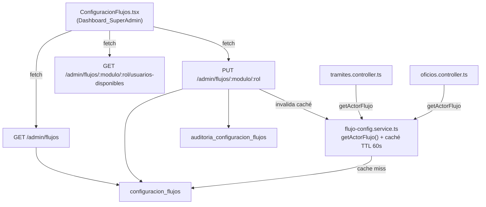

# Diseño Técnico — Configuración de Flujos por Módulo

## Descripción general

Esta feature permite al SuperAdmin configurar, desde el `Dashboard_SuperAdmin`, qué usuarios concretos desempeñan cada rol dentro del flujo de trabajo de cada módulo operativo del sistema. Reemplaza los valores `unidad_id` hardcodeados en el backend (actualmente `unidad_id=36` para el Revisor de Trámites y `unidad_id=35` para el Finalizador) por registros en base de datos consultados en tiempo de ejecución a través de un servicio con caché en memoria.

### Alcance

| Módulo | Roles configurables |
|---|---|
| `tramites_seguimiento` | `REVISOR`, `FINALIZADOR` |
| `supervision_eventos` | `DIRECTORA_GENERAL` |
| `oficialia_partes` | `ENCARGADO`, `SECRETARIA` |

---

## Arquitectura

El sistema sigue la arquitectura existente: Express + Knex en el backend, React con inline styles en el frontend. No se introducen nuevas dependencias.



### Decisiones de diseño

- **Caché en memoria (no Redis)**: El TTL de 60 s con un `Map` en proceso es suficiente para el volumen de operaciones actual. Evita añadir una dependencia de infraestructura.
- **UPSERT en `configuracion_flujos`**: La restricción UNIQUE sobre `(modulo_clave, rol_flujo)` garantiza exactamente un actor por rol. Se usa `INSERT ... ON CONFLICT DO UPDATE` para simplificar la lógica del endpoint PUT.
- **Invalidación explícita de caché**: El endpoint PUT llama a `invalidateActorFlujoCache(moduloClave, rolFlujo)` exportado por el servicio, en lugar de esperar el TTL, para que el cambio sea inmediato.
- **Reglas de compatibilidad centralizadas**: Se definen en un objeto `COMPATIBILITY_RULES` en el servicio, compartido entre la validación del PUT y el endpoint de usuarios disponibles.

---

## Componentes e interfaces

### 1. Script SQL de migración

**Archivo**: `infra/postgres/init/08_configuracion_flujos.sql`

Crea las tablas `configuracion_flujos` y `auditoria_configuracion_flujos`, e inserta los datos semilla con los valores actualmente hardcodeados.

### 2. Servicio de configuración

**Archivo**: `src/services/flujo-config.service.ts`

```typescript
// Interfaz pública del servicio
export async function getActorFlujo(
  moduloClave: string,
  rolFlujo: string
): Promise<number>

export function invalidateActorFlujoCache(
  moduloClave: string,
  rolFlujo: string
): void

export const COMPATIBILITY_RULES: Record<string, Record<string, CompatibilityRule>>

export interface CompatibilityRule {
  rolSistema: RolUsuario | RolUsuario[];
  unidadTipo?: TipoUnidad;
  descripcion: string;
}
```

La caché usa un `Map<string, { userId: number; expiresAt: number }>` donde la clave es `${moduloClave}:${rolFlujo}`.

### 3. Endpoints de administración

Se añaden al módulo `src/modules/admin/`:

| Método | Ruta | Función |
|---|---|---|
| `GET` | `/admin/flujos` | `listarFlujos` |
| `PUT` | `/admin/flujos/:modulo/:rol` | `actualizarFlujo` |
| `GET` | `/admin/flujos/:modulo/:rol/usuarios-disponibles` | `listarUsuariosDisponibles` |

### 4. Vista frontend

**Archivo**: `src/frontend/views/ConfiguracionFlujos.tsx`

Componente React que muestra una tarjeta por módulo, con la lista de roles configurables. Cada rol muestra el usuario asignado (nombre + email) o "Sin configurar", un botón de edición que abre un selector inline, y la fecha/autor de la última modificación.

Se integra en `Dashboard_SuperAdmin.tsx` como nueva entrada `'flujos'` en `NAV_ITEMS`.

### 5. Integración en `tramites.controller.ts`

La función `getUserTramiteRole` actualmente usa `user.oficina_id === 36` y `user.oficina_id === 35`. Se reemplaza por llamadas a `getActorFlujo`:

```typescript
// Antes (hardcodeado)
if (user.oficina_id === 36) return 'revisor';
if (user.oficina_id === 35) return 'finalizador';

// Después (dinámico)
const revisorId    = await getActorFlujo('tramites_seguimiento', 'REVISOR');
const finalizadorId = await getActorFlujo('tramites_seguimiento', 'FINALIZADOR');
if (user.id === revisorId) return 'revisor';
if (user.id === finalizadorId) return 'finalizador';
```

Las notificaciones que actualmente buscan `{ unidad_id: 36 }` o `{ unidad_id: 35 }` también se reemplazan por el `usuario_id` devuelto por `getActorFlujo`.

---

## Modelos de datos

### Tabla `configuracion_flujos`

```sql
CREATE TABLE IF NOT EXISTS configuracion_flujos (
  id                SERIAL       PRIMARY KEY,
  modulo_clave      VARCHAR(100) NOT NULL
                        REFERENCES modulos(clave)
                        ON UPDATE CASCADE ON DELETE RESTRICT,
  rol_flujo         VARCHAR(100) NOT NULL,
  usuario_id        INTEGER      NOT NULL
                        REFERENCES usuarios(id)
                        ON UPDATE CASCADE ON DELETE RESTRICT,
  actualizado_por_id INTEGER     NOT NULL
                        REFERENCES usuarios(id)
                        ON UPDATE CASCADE ON DELETE RESTRICT,
  actualizado_en    TIMESTAMPTZ  NOT NULL DEFAULT NOW(),
  CONSTRAINT uq_configuracion_flujos UNIQUE (modulo_clave, rol_flujo)
);
```

### Tabla `auditoria_configuracion_flujos`

```sql
CREATE TABLE IF NOT EXISTS auditoria_configuracion_flujos (
  id                  SERIAL       PRIMARY KEY,
  modulo_clave        VARCHAR(100) NOT NULL,
  rol_flujo           VARCHAR(100) NOT NULL,
  usuario_id_anterior INTEGER      REFERENCES usuarios(id) ON DELETE SET NULL,
  usuario_id_nuevo    INTEGER      NOT NULL REFERENCES usuarios(id) ON DELETE RESTRICT,
  actualizado_por_id  INTEGER      NOT NULL REFERENCES usuarios(id) ON DELETE RESTRICT,
  actualizado_en      TIMESTAMPTZ  NOT NULL DEFAULT NOW()
);
```

### Datos semilla

```sql
-- tramites_seguimiento / REVISOR → Director Jurídico (unidad_id=3, rol DIRECTOR)
INSERT INTO configuracion_flujos (modulo_clave, rol_flujo, usuario_id, actualizado_por_id)
SELECT 'tramites_seguimiento', 'REVISOR', u.id,
       (SELECT id FROM usuarios WHERE rol = 'SUPERADMIN' LIMIT 1)
FROM usuarios u
WHERE u.unidad_id = 3 AND u.rol = 'DIRECTOR' AND u.activo = true
LIMIT 1
ON CONFLICT (modulo_clave, rol_flujo) DO NOTHING;

-- tramites_seguimiento / FINALIZADOR → Operativo de TICS (unidad_id=2, rol OPERATIVO)
INSERT INTO configuracion_flujos (modulo_clave, rol_flujo, usuario_id, actualizado_por_id)
SELECT 'tramites_seguimiento', 'FINALIZADOR', u.id,
       (SELECT id FROM usuarios WHERE rol = 'SUPERADMIN' LIMIT 1)
FROM usuarios u
WHERE u.unidad_id = 2 AND u.rol = 'OPERATIVO' AND u.activo = true
LIMIT 1
ON CONFLICT (modulo_clave, rol_flujo) DO NOTHING;

-- oficialia_partes / ENCARGADO → primer usuario con rol ENCARGADO activo
INSERT INTO configuracion_flujos (modulo_clave, rol_flujo, usuario_id, actualizado_por_id)
SELECT 'oficialia_partes', 'ENCARGADO', u.id,
       (SELECT id FROM usuarios WHERE rol = 'SUPERADMIN' LIMIT 1)
FROM usuarios u
WHERE u.rol = 'ENCARGADO' AND u.activo = true
LIMIT 1
ON CONFLICT (modulo_clave, rol_flujo) DO NOTHING;

-- oficialia_partes / SECRETARIA → primer usuario con rol SECRETARIA activo
INSERT INTO configuracion_flujos (modulo_clave, rol_flujo, usuario_id, actualizado_por_id)
SELECT 'oficialia_partes', 'SECRETARIA', u.id,
       (SELECT id FROM usuarios WHERE rol = 'SUPERADMIN' LIMIT 1)
FROM usuarios u
WHERE u.rol = 'SECRETARIA' AND u.activo = true
LIMIT 1
ON CONFLICT (modulo_clave, rol_flujo) DO NOTHING;
```

> **Nota sobre los IDs hardcodeados**: El código actual usa `unidad_id=36` y `unidad_id=35`. Revisando el seed (`03_seed_dev.sql`) y el schema (`00_schema.sql`), las unidades del seed van del 1 al 7. Los IDs 35 y 36 corresponden a una base de datos de producción con más unidades. El seed de `configuracion_flujos` usa consultas dinámicas por `tipo` y `rol` para ser robusto en cualquier entorno.

### Tipos TypeScript compartidos

```typescript
// src/frontend/types.ts — añadir:
export interface ConfiguracionFlujo {
  modulo_clave:          string;
  modulo_nombre:         string;
  rol_flujo:             string;
  usuario_id:            number | null;
  usuario_nombre:        string | null;
  usuario_email:         string | null;
  usuario_rol:           RolUsuario | null;
  actualizado_en:        string | null;
  actualizado_por_nombre: string | null;
  regla_compatibilidad:  CompatibilityRuleInfo;
}

export interface CompatibilityRuleInfo {
  rol_sistema_requerido: string | string[];
  unidad_tipo_requerida?: string;
  descripcion:           string;
}

export interface UsuarioDisponible {
  id:           number;
  nombre:       string;
  email:        string;
  rol:          RolUsuario;
  unidad_nombre: string;
}
```

---

## Propiedades de corrección

*Una propiedad es una característica o comportamiento que debe ser verdadero en todas las ejecuciones válidas del sistema — esencialmente, una declaración formal sobre lo que el sistema debe hacer. Las propiedades sirven como puente entre las especificaciones legibles por humanos y las garantías de corrección verificables por máquina.*

### Propiedad 1: Idempotencia de la migración

*Para cualquier* estado inicial de la base de datos, ejecutar el script `08_configuracion_flujos.sql` dos veces consecutivas debe producir exactamente el mismo estado final (mismas tablas, mismas filas, sin errores).

**Valida: Requisito 1.2**

### Propiedad 2: Ausencia de configuración lanza error

*Para cualquier* par `(moduloClave, rolFlujo)` que no exista en la tabla `configuracion_flujos`, la función `getActorFlujo(moduloClave, rolFlujo)` debe lanzar un error que resulte en una respuesta HTTP 500 con un mensaje descriptivo.

**Valida: Requisitos 1.4, 5.8**

### Propiedad 3: Acceso restringido a SUPERADMIN

*Para cualquier* usuario con `rol !== 'SUPERADMIN'`, cualquier solicitud a los endpoints `GET /admin/flujos`, `PUT /admin/flujos/:modulo/:rol` y `GET /admin/flujos/:modulo/:rol/usuarios-disponibles` debe devolver HTTP 403.

**Valida: Requisitos 2.3, 3.3, 7.3**

### Propiedad 4: Round-trip de actualización de configuración

*Para cualquier* combinación válida de `(modulo_clave, rol_flujo, usuario_id)` donde el usuario cumple las reglas de compatibilidad, ejecutar `PUT /admin/flujos/:modulo/:rol` con ese `usuario_id` y luego `GET /admin/flujos` debe devolver ese mismo `usuario_id` para ese par módulo/rol.

**Valida: Requisitos 3.1, 3.2**

### Propiedad 5: Rechazo de usuarios incompatibles

*Para cualquier* usuario cuyo `rol` de sistema no cumpla la regla de compatibilidad del `rol_flujo` indicado (según `COMPATIBILITY_RULES`), la solicitud `PUT /admin/flujos/:modulo/:rol` debe devolver HTTP 422.

**Valida: Requisitos 3.7, 6.1, 6.2, 6.3, 6.4**

### Propiedad 6: Rechazo de usuarios inactivos o inexistentes

*Para cualquier* `usuario_id` que no exista en la tabla `usuarios` o que tenga `activo = false`, la solicitud `PUT /admin/flujos/:modulo/:rol` debe devolver HTTP 422.

**Valida: Requisito 3.6**

### Propiedad 7: Caché reduce consultas a la BD

*Para cualquier* par `(moduloClave, rolFlujo)` válido, llamar a `getActorFlujo` N veces consecutivas dentro del TTL de 60 segundos debe resultar en exactamente 1 consulta a la base de datos, independientemente de N.

**Valida: Requisito 5.6**

### Propiedad 8: Invalidación de caché tras actualización

*Para cualquier* par `(moduloClave, rolFlujo)`, si se llama a `getActorFlujo` (cacheando el resultado), luego se actualiza la configuración vía `PUT /admin/flujos/:modulo/:rol` con un nuevo `usuario_id`, la siguiente llamada a `getActorFlujo` debe devolver el nuevo `usuario_id`.

**Valida: Requisito 5.7**

### Propiedad 9: Usuarios disponibles cumplen reglas de compatibilidad

*Para cualquier* par válido `(modulo_clave, rol_flujo)`, todos los usuarios devueltos por `GET /admin/flujos/:modulo/:rol/usuarios-disponibles` deben cumplir la regla de compatibilidad correspondiente en `COMPATIBILITY_RULES` y tener `activo = true`.

**Valida: Requisitos 7.1, 7.5**

### Propiedad 10: Auditoría registra cambios correctamente

*Para cualquier* operación `PUT /admin/flujos/:modulo/:rol` exitosa realizada por cualquier SuperAdmin, debe existir un nuevo registro en `auditoria_configuracion_flujos` con `actualizado_por_id` igual al `id` del SuperAdmin autenticado, `usuario_id_nuevo` igual al `usuario_id` enviado, y `actualizado_en` con la marca de tiempo del momento del cambio.

**Valida: Requisitos 8.1, 8.3**

### Propiedad 11: Advertencia al desactivar usuario asignado a flujo

*Para cualquier* usuario que esté asignado como actor en al menos un flujo, la solicitud `PATCH /admin/usuarios/:id/toggle-activo` que lo desactive debe incluir en la respuesta una advertencia con los módulos y roles donde está asignado.

**Valida: Requisito 9.3**

---

## Manejo de errores

| Situación | Código HTTP | Mensaje |
|---|---|---|
| `modulo_clave` no existe en `modulos` | 404 | `"Módulo '{clave}' no encontrado"` |
| `rol_flujo` no válido para el módulo | 422 | `"Rol '{rol}' no es configurable para el módulo '{modulo}'. Roles válidos: [...]"` |
| `usuario_id` no existe | 422 | `"Usuario no encontrado"` |
| Usuario inactivo | 422 | `"El usuario está inactivo y no puede ser asignado a un flujo"` |
| Usuario incompatible con el rol | 422 | `"El usuario debe tener rol {rolRequerido}[y pertenecer a una unidad de tipo {tipoRequerido}]"` |
| Configuración faltante en tiempo de ejecución | 500 | `"Configuración de flujo incompleta: no se encontró actor para '{modulo}/{rol}'"` |
| Sin autenticación | 401 | Manejado por `authenticate` middleware existente |
| Sin rol SUPERADMIN | 403 | `"Acceso restringido a SUPERADMIN"` (guard existente) |

El servicio `getActorFlujo` lanza `AppError('Configuración de flujo incompleta: ...', 500)` que el error handler global de Express captura y serializa.

---

## Estrategia de pruebas

### Pruebas unitarias (ejemplo-based)

- `flujo-config.service.ts`: verificar que `getActorFlujo` devuelve el `usuario_id` correcto con un mock de Knex.
- `COMPATIBILITY_RULES`: verificar que cada módulo tiene sus roles definidos con los campos correctos.
- `listarFlujos`: verificar la estructura de la respuesta con datos de prueba.
- `listarUsuariosDisponibles`: verificar que el filtro por rol y tipo de unidad funciona correctamente.

### Pruebas de propiedades (property-based)

Se usa **fast-check** (ya disponible en el ecosistema Node/TypeScript) con mínimo 100 iteraciones por propiedad.

Cada prueba de propiedad se etiqueta con el formato:
`// Feature: configuracion-flujos-modulos, Property {N}: {texto}`

Las propiedades implementables como tests automatizados son:

- **Propiedad 2** (`getActorFlujo` lanza error para pares inexistentes): generar strings arbitrarios como `moduloClave` y `rolFlujo`, verificar que siempre lanza cuando no están en la BD.
- **Propiedad 3** (acceso restringido): generar usuarios con roles distintos a SUPERADMIN, verificar HTTP 403 en los tres endpoints.
- **Propiedad 5** (rechazo de usuarios incompatibles): generar usuarios con roles incompatibles para cada `rol_flujo`, verificar HTTP 422.
- **Propiedad 6** (rechazo de usuarios inactivos): generar `usuario_id` inexistentes o con `activo=false`, verificar HTTP 422.
- **Propiedad 7** (caché reduce consultas): llamar `getActorFlujo` N veces (N generado entre 2 y 50), verificar que el spy de Knex se llama exactamente 1 vez.
- **Propiedad 9** (usuarios disponibles cumplen reglas): para cada módulo/rol válido, verificar que todos los usuarios devueltos cumplen `isCompatible`.
- **Propiedad 10** (auditoría registra cambios): para cualquier PUT exitoso, verificar que existe el registro de auditoría con los campos correctos.

### Pruebas de integración

- Ejecutar el script SQL dos veces y verificar idempotencia (Propiedad 1).
- Verificar que el round-trip PUT → GET devuelve el valor actualizado (Propiedad 4).
- Verificar que la invalidación de caché funciona tras PUT (Propiedad 8).
- Verificar que `toggle-activo` incluye advertencia para usuarios asignados (Propiedad 11).

### Pruebas de humo (smoke)

- Verificar que las tablas `configuracion_flujos` y `auditoria_configuracion_flujos` existen con las columnas y constraints correctas.
- Verificar que los 4 registros semilla existen tras la migración inicial.
- Verificar que no existen endpoints DELETE/PATCH para registros de auditoría.
