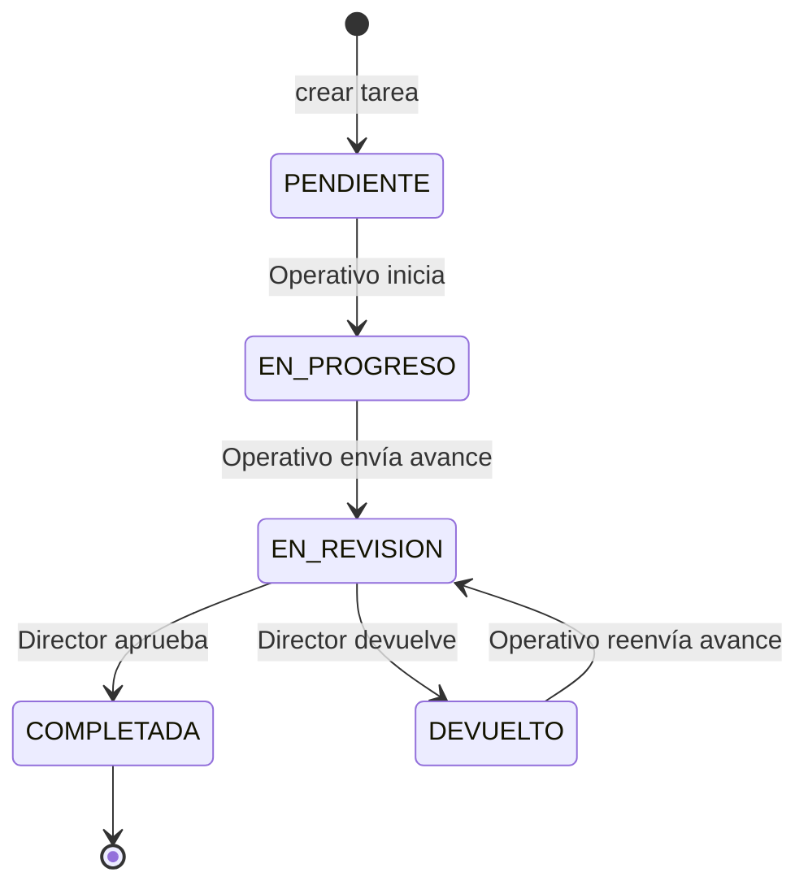
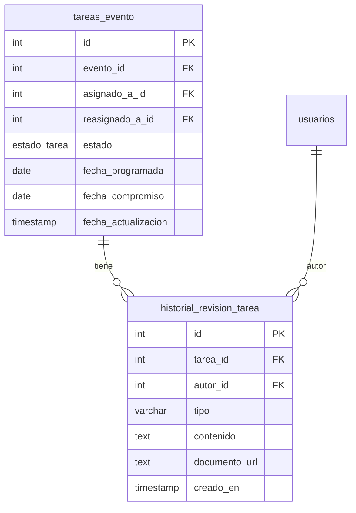

# Documento de Diseño — Flujo de Revisión de Tareas de Eventos

## Overview

Este documento describe el diseño técnico para extender el módulo de supervisión de eventos (`src/modules/eventos/`) con un ciclo formal de revisión de tareas. El flujo actual es lineal (`PENDIENTE → EN_PROGRESO → COMPLETADA`); el nuevo flujo introduce dos estados intermedios (`EN_REVISION`, `DEVUELTO`) y separa las responsabilidades de ejecución (Operativo) y aprobación (Director).

```
PENDIENTE → EN_PROGRESO → EN_REVISION → COMPLETADA
                               ↓              ↑
                           DEVUELTO ──────────┘
                           (ciclo sin límite)
```

El cambio afecta cuatro capas del sistema:

1. **Base de datos**: extensión del enum `estado_tarea` y nueva tabla `historial_revision_tarea`.
2. **Backend**: cuatro nuevos endpoints, actualización de `isValidTransition` y lógica de autorización por rol.
3. **Frontend**: actualización de `TareaRow` en `Dashboard_DirectorArea.tsx` (vista Operativo) y en `SeccionEventos.tsx` (vista Director).
4. **Notificaciones**: tres nuevos tipos de evento (`TAREA_EN_REVISION`, `TAREA_DEVUELTA`, `TAREA_COMPLETADA`).

---

## Architecture

El módulo sigue la arquitectura en capas ya establecida en el proyecto:

```
┌─────────────────────────────────────────────────────────────┐
│  Frontend (React + Vite)                                    │
│  Dashboard_DirectorArea.tsx  ←→  SeccionEventos.tsx         │
└────────────────────────┬────────────────────────────────────┘
                         │ HTTP / REST
┌────────────────────────▼────────────────────────────────────┐
│  Express Router  (eventos.routes.ts)                        │
│  + authenticate middleware (JWT)                            │
└────────────────────────┬────────────────────────────────────┘
                         │
┌────────────────────────▼────────────────────────────────────┐
│  Controller  (eventos.controller.ts)                        │
│  enviarRevision · aprobarTarea · devolverTarea              │
│  listarHistorial                                            │
└──────────┬─────────────────────────────┬────────────────────┘
           │ Knex (transacciones)        │ notifyEventoTarea
┌──────────▼──────────┐      ┌───────────▼──────────────────┐
│  PostgreSQL          │      │  Notification Dispatcher     │
│  tareas_evento       │      │  (inapp.channel.ts)          │
│  historial_revision  │      │  WebSocket / FCM             │
└─────────────────────┘      └──────────────────────────────┘
```

**Principios de diseño:**

- Las transiciones de estado y el registro del historial se ejecutan dentro de una única transacción de base de datos para garantizar atomicidad.
- Las notificaciones se disparan **fuera** de la transacción (`.catch(() => {})`) para que un fallo del canal de notificaciones no revierta la operación principal.
- La autorización se verifica **antes** de cualquier otra validación de negocio (estado, presencia de comentario), siguiendo el patrón ya establecido en el controller.
- No se introduce ninguna dependencia nueva; se reutilizan Knex, `notifyEventoTarea`, `AppError` y el middleware `authenticate`.

---

## Components and Interfaces

### 1. Base de datos

#### 1.1 Extensión del enum `estado_tarea`

```sql
ALTER TYPE estado_tarea ADD VALUE IF NOT EXISTS 'EN_REVISION';
ALTER TYPE estado_tarea ADD VALUE IF NOT EXISTS 'DEVUELTO';
```

Script idempotente: `IF NOT EXISTS` garantiza que ejecutarlo múltiples veces no genera errores.

#### 1.2 Nueva tabla `historial_revision_tarea`

```sql
CREATE TABLE IF NOT EXISTS historial_revision_tarea (
    id            SERIAL      PRIMARY KEY,
    tarea_id      INTEGER     NOT NULL
                      REFERENCES tareas_evento (id)
                      ON UPDATE CASCADE
                      ON DELETE CASCADE,
    autor_id      INTEGER     NOT NULL
                      REFERENCES usuarios (id)
                      ON UPDATE CASCADE
                      ON DELETE RESTRICT,
    tipo          VARCHAR(20) NOT NULL CHECK (tipo IN ('AVANCE', 'DEVOLUCION')),
    contenido     TEXT,
    documento_url TEXT,
    creado_en     TIMESTAMP   NOT NULL DEFAULT NOW()
);

CREATE INDEX IF NOT EXISTS idx_historial_rev_tarea    ON historial_revision_tarea (tarea_id);
CREATE INDEX IF NOT EXISTS idx_historial_rev_autor    ON historial_revision_tarea (autor_id);
CREATE INDEX IF NOT EXISTS idx_historial_rev_fecha    ON historial_revision_tarea (creado_en DESC);
```

La tabla es **append-only** por diseño: no se exponen endpoints de modificación ni eliminación. La restricción `CHECK` garantiza que solo existen los dos tipos válidos.

### 2. Backend — Tipos (`eventos.types.ts`)

#### 2.1 Actualización de `EstadoTarea`

```typescript
export type EstadoTarea =
  | 'PENDIENTE'
  | 'EN_PROGRESO'
  | 'EN_REVISION'
  | 'DEVUELTO'
  | 'COMPLETADA';
```

#### 2.2 Actualización de `isValidTransition`

```typescript
export function isValidTransition(actual: EstadoTarea, nuevo: EstadoTarea): boolean {
  const TRANSICIONES: Partial<Record<EstadoTarea, EstadoTarea[]>> = {
    PENDIENTE:   ['EN_PROGRESO'],
    EN_PROGRESO: ['EN_REVISION'],
    EN_REVISION: ['COMPLETADA', 'DEVUELTO'],
    DEVUELTO:    ['EN_REVISION'],
  };
  return TRANSICIONES[actual]?.includes(nuevo) ?? false;
}
```

#### 2.3 Nuevos tipos de request body

```typescript
export interface EnviarRevisionBody {
  comentario?:  string;   // al menos uno de los dos es obligatorio
  // documento: manejado por multer como req.file
}

export interface AprobarTareaBody {
  // sin body adicional — la acción es implícita
}

export interface DevolverTareaBody {
  comentario: string;   // obligatorio, no vacío
}

export interface RegistroHistorial {
  id:            number;
  tarea_id:      number;
  autor_id:      number;
  autor_nombre:  string;
  tipo:          'AVANCE' | 'DEVOLUCION';
  contenido:     string | null;
  documento_url: string | null;
  creado_en:     string;
}
```

#### 2.4 Actualización de `NotificationEventType`

```typescript
// En notification.types.ts — agregar al union type:
| 'TAREA_EN_REVISION'
| 'TAREA_DEVUELTA'
| 'TAREA_COMPLETADA'
```

### 3. Backend — Nuevos endpoints (`eventos.controller.ts`)

#### 3.1 `POST /eventos/:id/tareas/:tareaId/enviar-revision`

**Responsable:** Operativo asignado (`asignado_a_id`)  
**Estado requerido:** `EN_PROGRESO` o `DEVUELTO`  
**Validaciones:**
1. Autenticación JWT (middleware existente).
2. `req.user.id === tarea.asignado_a_id` → 403 si no coincide.
3. `isValidTransition(tarea.estado, 'EN_REVISION')` → 422 si inválido.
4. Al menos `comentario` no vacío o `req.file` presente → 422 si ninguno.

**Flujo:**
```
BEGIN TRANSACTION
  UPDATE tareas_evento SET estado = 'EN_REVISION', fecha_actualizacion = NOW()
  INSERT INTO historial_revision_tarea (tarea_id, autor_id, tipo='AVANCE', contenido, documento_url)
  [si hay archivo] → almacenar en servicio existente bajo eventos/avances/
COMMIT
→ notifyEventoTarea(Director, TAREA_EN_REVISION)  [fuera de transacción]
```

#### 3.2 `PATCH /eventos/:id/tareas/:tareaId/aprobar`

**Responsable:** Director que creó el evento (`evento.creado_por_id`)  
**Estado requerido:** `EN_REVISION`  
**Validaciones:**
1. `req.user.id === evento.creado_por_id` → 403 si no coincide.
2. `isValidTransition(tarea.estado, 'COMPLETADA')` → 422 si inválido.

**Flujo:**
```
BEGIN TRANSACTION
  UPDATE tareas_evento SET estado = 'COMPLETADA', fecha_actualizacion = NOW()
COMMIT
→ notifyEventoTarea(Operativo, TAREA_COMPLETADA)  [fuera de transacción]
```

#### 3.3 `PATCH /eventos/:id/tareas/:tareaId/devolver`

**Responsable:** Director que creó el evento (`evento.creado_por_id`)  
**Estado requerido:** `EN_REVISION`  
**Validaciones:**
1. `req.user.id === evento.creado_por_id` → 403 si no coincide.
2. `isValidTransition(tarea.estado, 'DEVUELTO')` → 422 si inválido.
3. `comentario` no vacío → 422 si falta o es solo espacios.

**Flujo:**
```
BEGIN TRANSACTION
  UPDATE tareas_evento SET estado = 'DEVUELTO', fecha_actualizacion = NOW()
  INSERT INTO historial_revision_tarea (tarea_id, autor_id, tipo='DEVOLUCION', contenido=comentario)
COMMIT
→ notifyEventoTarea(Operativo, TAREA_DEVUELTA)  [fuera de transacción]
```

#### 3.4 `GET /eventos/:id/tareas/:tareaId/historial`

**Acceso:** Director del evento (`evento.creado_por_id`) o Operativo asignado (`tarea.asignado_a_id`)  
**Respuesta:** Array de `RegistroHistorial` ordenado por `creado_en ASC`.

```typescript
// JOIN con usuarios para obtener autor_nombre
SELECT h.*, u.nombre as autor_nombre
FROM historial_revision_tarea h
JOIN usuarios u ON u.id = h.autor_id
WHERE h.tarea_id = :tareaId
ORDER BY h.creado_en ASC
```

### 4. Backend — Rutas actualizadas (`eventos.routes.ts`)

```typescript
// Nuevas rutas a agregar:
router.post('/:id/tareas/:tareaId/enviar-revision',  upload.single('documento'), enviarRevision);
router.patch('/:id/tareas/:tareaId/aprobar',          aprobarTarea);
router.patch('/:id/tareas/:tareaId/devolver',         devolverTarea);
router.get('/:id/tareas/:tareaId/historial',          listarHistorial);
```

`upload.single('documento')` usa el middleware `multer` ya configurado en el proyecto para manejar el archivo opcional de avance.

### 5. Frontend — Actualización de tipos (`types.ts`)

```typescript
// Actualizar el union type:
export type EstadoTarea =
  | 'PENDIENTE'
  | 'EN_PROGRESO'
  | 'EN_REVISION'
  | 'DEVUELTO'
  | 'COMPLETADA';

// Nuevo tipo para el historial:
export interface RegistroHistorial {
  id:            number;
  tarea_id:      number;
  autor_id:      number;
  autor_nombre:  string;
  tipo:          'AVANCE' | 'DEVOLUCION';
  contenido:     string | null;
  documento_url: string | null;
  creado_en:     string;
}
```

### 6. Frontend — `Dashboard_DirectorArea.tsx` (vista Operativo)

**Cambios en `ESTADO_CFG`:** agregar entradas para `EN_REVISION` y `DEVUELTO`.

**Cambios en `SIGUIENTE_ESTADO`:** el botón de avance para el Operativo cambia:
- `EN_PROGRESO` → ya no avanza directamente a `COMPLETADA`; en su lugar muestra el botón **"Enviar para revisión"** que abre un modal.
- `DEVUELTO` → muestra el botón **"Reenviar para revisión"** que abre el mismo modal.

**Nuevo modal `EnviarRevisionModal`:**
- Campo de texto para comentario (opcional si hay archivo).
- Input de archivo para documento de avance (opcional si hay comentario).
- Validación client-side: al menos uno de los dos debe estar presente.
- Envía `multipart/form-data` a `POST /eventos/:id/tareas/:tareaId/enviar-revision`.

**Cambios en `TareaRow`:**
- Mostrar badge de estado para `EN_REVISION` (color naranja) y `DEVUELTO` (color rojo claro).
- Cuando el estado es `EN_REVISION`: mostrar mensaje "En revisión por el Director" (sin botón de acción).
- Cuando el estado es `DEVUELTO`: mostrar el comentario de devolución del último registro del historial y el botón "Reenviar para revisión".
- Botón **"Ver historial"** disponible para todos los estados con al menos un registro.

### 7. Frontend — `SeccionEventos.tsx` (vista Director)

**Cambios en `ESTADO_TAREA_CFG`:** agregar entradas para `EN_REVISION` y `DEVUELTO`.

**Cambios en `TareaRow` (versión Director):**
- Cuando el estado es `EN_REVISION`: mostrar botones **"Aprobar"** y **"Devolver"**.
  - **Aprobar**: llama a `PATCH /eventos/:id/tareas/:tareaId/aprobar`.
  - **Devolver**: abre un modal con campo de comentario obligatorio, llama a `PATCH /eventos/:id/tareas/:tareaId/devolver`.
- Mostrar el avance enviado por el Operativo (comentario y/o enlace al documento).
- Botón **"Ver historial"** disponible para todos los estados con al menos un registro.

---

## Data Models

### Tabla `historial_revision_tarea`

| Columna        | Tipo         | Restricciones                          | Descripción                                      |
|----------------|--------------|----------------------------------------|--------------------------------------------------|
| `id`           | SERIAL       | PRIMARY KEY                            | Identificador único                              |
| `tarea_id`     | INTEGER      | NOT NULL, FK → tareas_evento(id)       | Tarea a la que pertenece el registro             |
| `autor_id`     | INTEGER      | NOT NULL, FK → usuarios(id)            | Usuario que generó el registro                   |
| `tipo`         | VARCHAR(20)  | NOT NULL, CHECK IN ('AVANCE','DEVOLUCION') | Tipo de registro                             |
| `contenido`    | TEXT         | nullable                               | Comentario de avance o de devolución             |
| `documento_url`| TEXT         | nullable                               | Ruta al archivo de avance (solo tipo AVANCE)     |
| `creado_en`    | TIMESTAMP    | NOT NULL DEFAULT NOW()                 | Marca de tiempo de creación                      |

**Invariantes:**
- `tipo = 'AVANCE'` → generado por el Operativo al enviar a revisión.
- `tipo = 'DEVOLUCION'` → generado por el Director al devolver; `contenido` siempre no nulo.
- Al menos uno de `contenido` o `documento_url` debe ser no nulo cuando `tipo = 'AVANCE'`.
- Los registros son inmutables: no se exponen endpoints de modificación ni eliminación.

### Enum `estado_tarea` (extendido)

| Valor         | Actor que lo establece | Transiciones salientes          |
|---------------|------------------------|---------------------------------|
| `PENDIENTE`   | Sistema (al crear)     | → `EN_PROGRESO`                 |
| `EN_PROGRESO` | Operativo              | → `EN_REVISION`                 |
| `EN_REVISION` | Operativo              | → `COMPLETADA`, → `DEVUELTO`    |
| `DEVUELTO`    | Director               | → `EN_REVISION`                 |
| `COMPLETADA`  | Director               | (estado terminal)               |

### Diagrama de flujo de estados



### Relación entre entidades



---

## Correctness Properties

*Una propiedad es una característica o comportamiento que debe mantenerse verdadero en todas las ejecuciones válidas del sistema — esencialmente, una declaración formal sobre lo que el sistema debe hacer. Las propiedades sirven como puente entre las especificaciones legibles por humanos y las garantías de corrección verificables por máquinas.*

### Property 1: Completitud y exclusividad de transiciones válidas

*Para cualquier* par `(estadoActual, estadoNuevo)` del enum `EstadoTarea`, la función `isValidTransition` debe retornar `true` exactamente para las cinco transiciones del flujo definido y `false` para todos los demás pares posibles.

**Validates: Requirements 1.1, 1.4, 5.6**

### Property 2: Autorización de envío a revisión

*Para cualquier* tarea en estado `EN_PROGRESO` o `DEVUELTO`, solo el usuario cuyo `id` coincide con `tarea.asignado_a_id` puede ejecutar la transición a `EN_REVISION`; cualquier otro usuario recibe HTTP 403 independientemente de su rol.

**Validates: Requirements 2.3, 6.2, 6.7**

### Property 3: Autorización de aprobación y devolución

*Para cualquier* tarea en estado `EN_REVISION`, solo el usuario cuyo `id` coincide con `evento.creado_por_id` puede aprobar (→ `COMPLETADA`) o devolver (→ `DEVUELTO`); cualquier otro usuario recibe HTTP 403 antes de evaluar cualquier otra validación.

**Validates: Requirements 3.5, 6.3, 6.6**

### Property 4: Validación de comentario obligatorio al devolver

*Para cualquier* string de comentario compuesto únicamente de espacios en blanco (incluyendo el string vacío), la acción de devolución debe ser rechazada con HTTP 422, y el estado de la tarea no debe cambiar.

**Validates: Requirements 3.4**

### Property 5: Resiliencia ante fallos de notificación

*Para cualquier* transición de estado exitosa (enviar revisión, aprobar, devolver), si el servicio de notificaciones lanza un error, la respuesta HTTP debe ser exitosa (2xx) y el estado de la tarea en la base de datos debe reflejar la transición correctamente.

**Validates: Requirements 7.4**

### Property 6: Ordenamiento e integridad del historial

*Para cualquier* tarea con N registros en `historial_revision_tarea`, los registros devueltos por `GET /eventos/:id/tareas/:tareaId/historial` deben estar ordenados por `creado_en` ascendente, y cada registro debe contener los campos `autor_nombre`, `tipo`, `creado_en`.

**Validates: Requirements 4.2**

### Property 7: Autorización de acceso al historial

*Para cualquier* tarea, solo el usuario con `id = evento.creado_por_id` (Director) o `id = tarea.asignado_a_id` (Operativo) puede acceder al historial; cualquier otro usuario recibe HTTP 403.

**Validates: Requirements 4.3**

### Property 8: Preservación de estados en migración

*Para cualquier* conjunto de tareas existentes con estados `PENDIENTE`, `EN_PROGRESO` o `COMPLETADA`, después de ejecutar el script de migración, cada tarea debe conservar exactamente el mismo estado que tenía antes de la migración.

**Validates: Requirements 5.2, 5.3, 5.4**

---

## Error Handling

### Códigos HTTP y condiciones de error

| Código | Condición                                                                 | Endpoint(s)                          |
|--------|---------------------------------------------------------------------------|--------------------------------------|
| 403    | Usuario no es el Operativo asignado                                       | `enviar-revision`                    |
| 403    | Usuario no es el Director creador del evento                              | `aprobar`, `devolver`                |
| 403    | Usuario sin relación con la tarea solicita historial                      | `historial`                          |
| 404    | Tarea o evento no encontrado                                              | Todos los nuevos endpoints           |
| 422    | Transición de estado inválida (incluye estado incorrecto)                 | `enviar-revision`, `aprobar`, `devolver` |
| 422    | Sin comentario y sin documento al enviar revisión                         | `enviar-revision`                    |
| 422    | Comentario vacío o solo espacios al devolver                              | `devolver`                           |

### Orden de validaciones (todos los endpoints nuevos)

1. **Autenticación** — middleware `authenticate` (401 si token inválido).
2. **Existencia** — verificar que la tarea y el evento existen (404).
3. **Autorización** — verificar que el usuario tiene permiso (403).
4. **Estado** — verificar que la transición es válida con `isValidTransition` (422).
5. **Contenido** — validar campos obligatorios del body (422).
6. **Operación** — ejecutar la transacción de BD.
7. **Notificación** — disparar notificación fuera de la transacción (errores silenciados con `.catch(() => {})`).

### Manejo de errores de almacenamiento de archivos

Si el almacenamiento del documento de avance falla después de que la transacción de BD se ha iniciado, la transacción debe hacer rollback y retornar HTTP 500. El archivo no debe quedar huérfano en el sistema de almacenamiento.

---

## Testing Strategy

### Enfoque dual

El módulo usa dos tipos de pruebas complementarias:

- **Pruebas de propiedad** (fast-check): verifican invariantes universales sobre funciones puras y comportamiento del sistema con entradas generadas aleatoriamente.
- **Pruebas de ejemplo** (Vitest): verifican escenarios concretos, casos de integración y flujos completos.

### Pruebas de propiedad (fast-check)

La librería de PBT es **fast-check** (ya instalada como devDependency). Cada prueba de propiedad se configura con mínimo **100 iteraciones**.

Cada prueba debe incluir un comentario de etiqueta con el formato:
```
// Feature: flujo-revision-tareas-eventos, Property N: <texto de la propiedad>
```

**Property 1 — Completitud y exclusividad de `isValidTransition`:**
```typescript
// Feature: flujo-revision-tareas-eventos, Property 1: completitud y exclusividad de transiciones
fc.assert(fc.property(
  fc.constantFrom(...TODOS_LOS_ESTADOS),
  fc.constantFrom(...TODOS_LOS_ESTADOS),
  (actual, nuevo) => {
    const resultado = isValidTransition(actual, nuevo);
    const esValida  = TRANSICIONES_VALIDAS.some(([a, n]) => a === actual && n === nuevo);
    return resultado === esValida;
  }
), { numRuns: 100 });
```

**Property 2 — Autorización de envío a revisión:**
Generar tareas aleatorias en estado `EN_PROGRESO` o `DEVUELTO` con un `asignado_a_id` aleatorio. Verificar que solo ese usuario puede enviar a revisión.

**Property 3 — Autorización de aprobación y devolución:**
Generar tareas en estado `EN_REVISION` con un `creado_por_id` aleatorio. Verificar que solo ese usuario puede aprobar o devolver.

**Property 4 — Validación de comentario vacío:**
```typescript
// Feature: flujo-revision-tareas-eventos, Property 4: comentario vacío rechazado
fc.assert(fc.property(
  fc.stringMatching(/^\s*$/),  // strings de solo espacios en blanco
  (comentario) => {
    const resultado = validarComentarioDevolución(comentario);
    return resultado === false;
  }
), { numRuns: 100 });
```

**Property 5 — Resiliencia ante fallos de notificación:**
Mockear `notifyEventoTarea` para que lance un error. Verificar que la respuesta HTTP es 2xx y el estado en BD es correcto.

**Property 6 — Ordenamiento del historial:**
Generar N registros con timestamps aleatorios. Verificar que el endpoint los retorna ordenados por `creado_en` ASC.

**Property 7 — Autorización del historial:**
Generar usuarios aleatorios que no sean el Director ni el Operativo. Verificar que todos reciben 403.

**Property 8 — Preservación de estados en migración:**
Generar conjuntos de tareas con estados `PENDIENTE`, `EN_PROGRESO`, `COMPLETADA`. Verificar que después de la migración los estados son idénticos.

### Pruebas de ejemplo (Vitest)

- Flujo completo: `PENDIENTE → EN_PROGRESO → EN_REVISION → COMPLETADA` (happy path).
- Flujo con devolución: `EN_PROGRESO → EN_REVISION → DEVUELTO → EN_REVISION → COMPLETADA`.
- Rechazo de transición inválida: intentar `PENDIENTE → COMPLETADA` → 422.
- Rechazo de envío sin avance: sin comentario y sin archivo → 422.
- Rechazo de devolución sin comentario → 422.
- Verificación de notificaciones: mock de `notifyEventoTarea` y verificación de llamadas.
- Verificación de historial: estructura y orden de registros.

### Pruebas de integración

- Almacenamiento de documento de avance bajo `eventos/avances/`.
- Envío de notificaciones in-app a través del dispatcher real.
- Atomicidad de transacciones: simular fallo en el INSERT del historial y verificar rollback del UPDATE de estado.

### Pruebas de smoke

- El script de migración SQL es idempotente (ejecutar dos veces sin errores).
- Los tipos `TAREA_EN_REVISION`, `TAREA_DEVUELTA`, `TAREA_COMPLETADA` están definidos en `NotificationEventType`.
- No existen endpoints DELETE o PUT para `historial_revision_tarea`.
