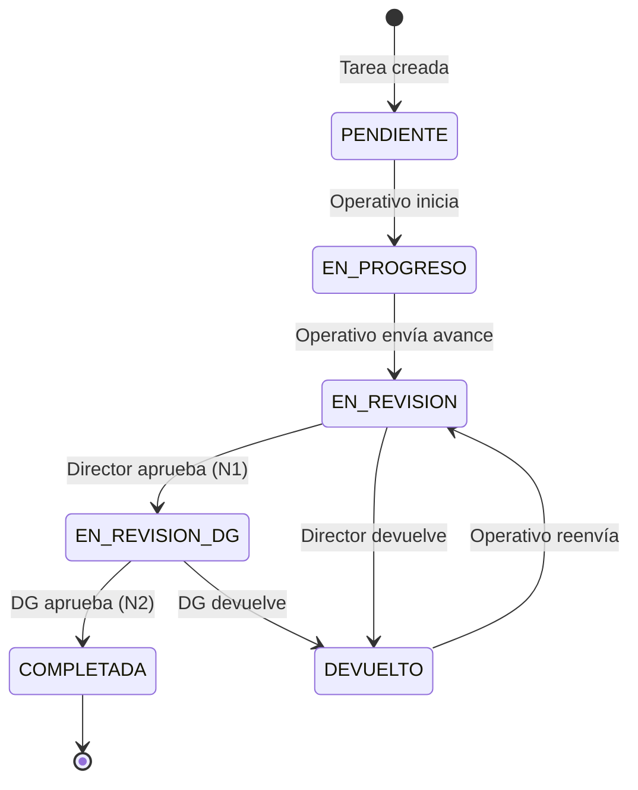

# Design Document: Revisión de Doble Nivel en Tareas de Eventos

## Overview

Este documento describe el diseño técnico para extender el flujo de revisión de tareas de eventos (`flujo-revision-tareas-eventos`) con una segunda capa de aprobación a cargo de la Directora General. El cambio afecta cuatro capas: base de datos, backend (tipos, lógica de transiciones, endpoints), notificaciones y frontend.

**Flujo de estados completo tras la migración:**

```
PENDIENTE → EN_PROGRESO → EN_REVISION → EN_REVISION_DG → COMPLETADA
                                    ↘ DEVUELTO ↗         ↘ DEVUELTO ↗
```

El Operativo envía avances al Director de Área (primer nivel). Si el Director aprueba, la tarea sube a `EN_REVISION_DG` para que la Directora General la revise (segundo nivel). Solo la aprobación de la DG marca la tarea como `COMPLETADA`. Cualquier devolución desde cualquier nivel regresa la tarea a `DEVUELTO`, y el Operativo puede reenviarla al primer nivel.

---

## Architecture

El sistema sigue la arquitectura en capas ya establecida en el proyecto:

```
Frontend (React/TSX)
    │  fetch / multipart
    ▼
Express Router  (eventos.routes.ts)
    │  authenticate middleware
    ▼
Controller      (eventos.controller.ts)
    │  db (knex)  +  notifyEventoTarea
    ▼
PostgreSQL       (tareas_evento, historial_revision_tarea)
    │
    └── Notification Dispatcher  (notification.dispatcher.ts)
            └── In-App channel   (notificaciones table)
```

No se introduce ninguna capa nueva. Los cambios son aditivos sobre la arquitectura existente:

- **BD**: un nuevo valor de enum + una columna nueva + extensión del CHECK constraint.
- **Backend**: actualización de `isValidTransition`, modificación de `aprobarTarea`, dos endpoints nuevos, una función helper `resolverDirectoraGeneral`.
- **Notificaciones**: cuatro nuevos tipos de evento.
- **Frontend**: nuevo panel DG, actualización de badges y acciones en vistas existentes.

---

## Components and Interfaces

### 1. Migración de Base de Datos

**Archivo:** `infra/postgres/init/10_revision_doble_nivel.sql`

El script es idempotente y puede ejecutarse múltiples veces sin errores.

```sql
-- ============================================================
-- MIGRACIÓN: Revisión de Doble Nivel en Tareas de Eventos
-- File: infra/postgres/init/10_revision_doble_nivel.sql
-- Idempotente: puede ejecutarse múltiples veces sin errores
-- ============================================================

-- 1. Nuevo valor en el enum estado_tarea
ALTER TYPE estado_tarea ADD VALUE IF NOT EXISTS 'EN_REVISION_DG';

-- 2. Columna nivel_revision en historial_revision_tarea
--    DEFAULT 1 garantiza que los registros existentes reciban nivel 1
ALTER TABLE historial_revision_tarea
  ADD COLUMN IF NOT EXISTS nivel_revision SMALLINT NOT NULL DEFAULT 1;

-- 3. Extender el CHECK constraint de la columna tipo
--    PostgreSQL no soporta ALTER CONSTRAINT directamente;
--    se elimina el viejo y se crea el nuevo de forma idempotente.
DO $$
BEGIN
  -- Eliminar constraint existente si existe (cualquier nombre)
  IF EXISTS (
    SELECT 1 FROM information_schema.table_constraints
    WHERE table_name = 'historial_revision_tarea'
      AND constraint_type = 'CHECK'
      AND constraint_name LIKE '%tipo%'
  ) THEN
    EXECUTE (
      SELECT 'ALTER TABLE historial_revision_tarea DROP CONSTRAINT ' || constraint_name
      FROM information_schema.table_constraints
      WHERE table_name = 'historial_revision_tarea'
        AND constraint_type = 'CHECK'
        AND constraint_name LIKE '%tipo%'
      LIMIT 1
    );
  END IF;

  -- Agregar nuevo constraint con todos los valores válidos
  IF NOT EXISTS (
    SELECT 1 FROM information_schema.table_constraints
    WHERE table_name = 'historial_revision_tarea'
      AND constraint_name = 'historial_revision_tarea_tipo_check_v2'
  ) THEN
    ALTER TABLE historial_revision_tarea
      ADD CONSTRAINT historial_revision_tarea_tipo_check_v2
      CHECK (tipo IN ('AVANCE', 'DEVOLUCION', 'APROBACION_N1', 'APROBACION_N2'));
  END IF;
END;
$$;

-- ============================================================
-- FIN DEL SCRIPT
-- ============================================================
```

**Diagrama del esquema de BD relevante:**

```
tareas_evento
┌─────────────────────────────────────────────────────────┐
│ id            SERIAL PK                                  │
│ evento_id     INTEGER FK → eventos.id                   │
│ titulo        VARCHAR                                    │
│ asignado_a_id INTEGER FK → usuarios.id                  │
│ estado        estado_tarea  ← NUEVO VALOR: EN_REVISION_DG│
│ fecha_programada DATE                                    │
│ fecha_actualizacion TIMESTAMP                           │
└─────────────────────────────────────────────────────────┘

historial_revision_tarea
┌─────────────────────────────────────────────────────────┐
│ id             SERIAL PK                                 │
│ tarea_id       INTEGER FK → tareas_evento.id            │
│ autor_id       INTEGER FK → usuarios.id                 │
│ tipo           VARCHAR(20)                               │
│                CHECK IN ('AVANCE','DEVOLUCION',          │
│                          'APROBACION_N1','APROBACION_N2')│
│ nivel_revision SMALLINT NOT NULL DEFAULT 1  ← NUEVO     │
│ contenido      TEXT                                      │
│ documento_url  TEXT                                      │
│ creado_en      TIMESTAMP DEFAULT NOW()                  │
└─────────────────────────────────────────────────────────┘

catalogo_unidades (sin cambios)
┌─────────────────────────────────────────────────────────┐
│ id     SERIAL PK                                         │
│ nombre VARCHAR                                           │
│ tipo   VARCHAR  ← 'DIRECCION_GENERAL' identifica a la DG│
│ activo BOOLEAN                                           │
└─────────────────────────────────────────────────────────┘
```

### 2. Tipos TypeScript — Backend (`eventos.types.ts`)

**Cambios en `EstadoTarea`:**

```typescript
export type EstadoTarea =
  | 'PENDIENTE'
  | 'EN_PROGRESO'
  | 'EN_REVISION'
  | 'EN_REVISION_DG'   // ← NUEVO
  | 'DEVUELTO'
  | 'COMPLETADA';
```

**Nueva función `isValidTransition` con las 7 transiciones del flujo:**

```typescript
export function isValidTransition(actual: EstadoTarea, nuevo: EstadoTarea): boolean {
  const TRANSICIONES: Partial<Record<EstadoTarea, EstadoTarea[]>> = {
    PENDIENTE:       ['EN_PROGRESO'],
    EN_PROGRESO:     ['EN_REVISION'],
    EN_REVISION:     ['EN_REVISION_DG', 'DEVUELTO'],  // Director aprueba → DG; Director devuelve → DEVUELTO
    EN_REVISION_DG:  ['COMPLETADA', 'DEVUELTO'],       // DG aprueba → COMPLETADA; DG devuelve → DEVUELTO
    DEVUELTO:        ['EN_REVISION'],                  // Operativo reenvía siempre al primer nivel
  };
  return TRANSICIONES[actual]?.includes(nuevo) ?? false;
}
```

**Nuevas interfaces:**

```typescript
export interface RegistroHistorial {
  id:             number;
  tarea_id:       number;
  autor_id:       number;
  autor_nombre:   string;
  tipo:           'AVANCE' | 'DEVOLUCION' | 'APROBACION_N1' | 'APROBACION_N2';
  nivel_revision: 1 | 2;   // ← NUEVO
  contenido:      string | null;
  documento_url:  string | null;
  creado_en:      string;
}

export interface AprobarTareaDGBody {
  // Sin body requerido; la autorización se verifica por identidad de la DG
}

export interface DevolverTareaDGBody {
  comentario: string;   // obligatorio, no vacío ni solo espacios
}
```

### 3. Función `resolverDirectoraGeneral`

Esta función consulta la BD en cada llamada para que un cambio de asignación se refleje sin reiniciar el servidor. No usa caché.

```typescript
// En eventos.controller.ts

/**
 * Resuelve el ID de la Directora General consultando la BD en tiempo de ejecución.
 * Identifica al usuario con rol DIRECTOR en la unidad de tipo DIRECCION_GENERAL.
 * Si hay más de uno, retorna el de menor id (resultado determinista).
 * Lanza AppError 503 si no existe ninguno.
 */
async function resolverDirectoraGeneral(db: Knex): Promise<number> {
  const rows = await db('usuarios as u')
    .join('catalogo_unidades as cu', 'cu.id', 'u.unidad_id')
    .where('cu.tipo', 'DIRECCION_GENERAL')
    .where('u.rol', 'DIRECTOR')
    .where('u.activo', true)
    .select('u.id')
    .orderBy('u.id', 'asc');

  if (rows.length === 0) {
    throw new AppError(
      'El segundo nivel de revisión no está configurado: no existe un Director activo en la unidad DIRECCION_GENERAL',
      503,
    );
  }

  return rows[0].id as number;
}
```

> **Nota de diseño:** La función existente `getIdDireccionGeneral()` resuelve el *ID de la unidad*, no el *ID del usuario*. `resolverDirectoraGeneral` es complementaria y resuelve el *ID del usuario* DG directamente. Ambas coexisten.

### 4. Modificación de `aprobarTarea`

El endpoint existente `PATCH /eventos/:id/tareas/:tareaId/aprobar` cambia su destino de `COMPLETADA` a `EN_REVISION_DG`.

**Pseudocódigo del endpoint modificado:**

```
aprobarTarea(req, res, next):
  eventoId = parseInt(req.params.id)
  tareaId  = parseInt(req.params.tareaId)

  // 1. Existencia
  tarea  = await db('tareas_evento').where({ id: tareaId, evento_id: eventoId }).first()
  if !tarea → throw AppError(404)

  evento = await db('eventos').where({ id: eventoId }).first()
  if !evento → throw AppError(404)

  // 2. Autorización — solo el creador del evento (Director de Área)
  if req.user.id !== evento.creado_por_id → throw AppError(403)

  // 3. Transición válida: EN_REVISION → EN_REVISION_DG
  if !isValidTransition(tarea.estado, 'EN_REVISION_DG') → throw AppError(422)

  // 4. Resolver DG (puede lanzar 503 si no está configurada)
  dgId = await resolverDirectoraGeneral(db)

  // 5. Transacción atómica
  await db.transaction(async (trx) => {
    await trx('tareas_evento').where({ id: tareaId }).update({
      estado: 'EN_REVISION_DG',
      fecha_actualizacion: trx.fn.now(),
    })
    await trx('historial_revision_tarea').insert({
      tarea_id:       tareaId,
      autor_id:       req.user.id,
      tipo:           'APROBACION_N1',
      nivel_revision: 1,
      contenido:      null,
      creado_en:      trx.fn.now(),
    })
  })

  res.json({ message: 'Tarea elevada a revisión de la Directora General' })

  // 6. Notificaciones fuera de transacción (fire-and-forget)
  notifyEventoTarea({ recipient_id: dgId, event: 'TAREA_EN_REVISION_DG', ... }).catch(() => {})
  notifyEventoTarea({ recipient_id: tarea.asignado_a_id, event: 'TAREA_APROBADA_N1', ... }).catch(() => {})
```

### 5. Nuevo endpoint `aprobarTareaDG`

**Ruta:** `PATCH /eventos/:id/tareas/:tareaId/aprobar-dg`

```
aprobarTareaDG(req, res, next):
  eventoId = parseInt(req.params.id)
  tareaId  = parseInt(req.params.tareaId)

  // 1. Autorización — verificar que el usuario ES la DG (antes de cualquier otra validación)
  dgId = await resolverDirectoraGeneral(db)
  if req.user.id !== dgId → throw AppError(403)

  // 2. Existencia
  tarea  = await db('tareas_evento').where({ id: tareaId, evento_id: eventoId }).first()
  if !tarea → throw AppError(404)

  evento = await db('eventos').where({ id: eventoId }).first()
  if !evento → throw AppError(404)

  // 3. Transición válida: EN_REVISION_DG → COMPLETADA
  if !isValidTransition(tarea.estado, 'COMPLETADA') → throw AppError(422, estado actual)

  // 4. Transacción atómica
  await db.transaction(async (trx) => {
    await trx('tareas_evento').where({ id: tareaId }).update({
      estado: 'COMPLETADA',
      fecha_actualizacion: trx.fn.now(),
    })
    await trx('historial_revision_tarea').insert({
      tarea_id:       tareaId,
      autor_id:       req.user.id,
      tipo:           'APROBACION_N2',
      nivel_revision: 2,
      contenido:      null,
      creado_en:      trx.fn.now(),
    })
  })

  res.json({ message: 'Tarea aprobada definitivamente por la Directora General' })

  // 5. Notificaciones fuera de transacción
  notifyEventoTarea({ recipient_id: tarea.asignado_a_id, event: 'TAREA_COMPLETADA_DG', ... }).catch(() => {})
  notifyEventoTarea({ recipient_id: evento.creado_por_id, event: 'TAREA_COMPLETADA_DG', ... }).catch(() => {})
```

### 6. Nuevo endpoint `devolverTareaDG`

**Ruta:** `PATCH /eventos/:id/tareas/:tareaId/devolver-dg`

```
devolverTareaDG(req, res, next):
  eventoId = parseInt(req.params.id)
  tareaId  = parseInt(req.params.tareaId)

  // 1. Autorización — verificar que el usuario ES la DG
  dgId = await resolverDirectoraGeneral(db)
  if req.user.id !== dgId → throw AppError(403)

  // 2. Existencia
  tarea  = await db('tareas_evento').where({ id: tareaId, evento_id: eventoId }).first()
  if !tarea → throw AppError(404)

  evento = await db('eventos').where({ id: eventoId }).first()
  if !evento → throw AppError(404)

  // 3. Transición válida: EN_REVISION_DG → DEVUELTO
  if !isValidTransition(tarea.estado, 'DEVUELTO') → throw AppError(422, estado actual)

  // 4. Comentario obligatorio
  { comentario } = req.body
  if !comentario?.trim() → throw AppError(422, 'El comentario es obligatorio al devolver')

  // 5. Transacción atómica
  await db.transaction(async (trx) => {
    await trx('tareas_evento').where({ id: tareaId }).update({
      estado: 'DEVUELTO',
      fecha_actualizacion: trx.fn.now(),
    })
    await trx('historial_revision_tarea').insert({
      tarea_id:       tareaId,
      autor_id:       req.user.id,
      tipo:           'DEVOLUCION',
      nivel_revision: 2,
      contenido:      comentario.trim(),
      creado_en:      trx.fn.now(),
    })
  })

  res.json({ message: 'Tarea devuelta al Operativo desde el segundo nivel de revisión' })

  // 6. Notificación fuera de transacción
  notifyEventoTarea({ recipient_id: tarea.asignado_a_id, event: 'TAREA_DEVUELTA_DG', ... }).catch(() => {})
```

### 7. Actualización de rutas (`eventos.routes.ts`)

```typescript
// Flujo de revisión — segundo nivel (DG)
router.patch('/:id/tareas/:tareaId/aprobar-dg', aprobarTareaDG);
router.patch('/:id/tareas/:tareaId/devolver-dg', devolverTareaDG);
```

Las rutas existentes no cambian su firma.

### 8. Nuevos tipos de notificación

**`notification.types.ts`** — agregar al union `NotificationEventType`:

```typescript
| 'TAREA_EN_REVISION_DG'   // DG recibe: tarea elevada al segundo nivel
| 'TAREA_APROBADA_N1'      // Operativo recibe: Director aprobó, pendiente DG
| 'TAREA_COMPLETADA_DG'    // Operativo y Director reciben: DG aprobó definitivamente
| 'TAREA_DEVUELTA_DG'      // Operativo recibe: DG devolvió con comentario
```

**`templates.ts`** — nuevas funciones de plantilla:

| Tipo | Destinatario | Título | Cuerpo |
|------|-------------|--------|--------|
| `TAREA_EN_REVISION_DG` | Directora General | "Tarea pendiente de aprobación final" | `{Director} aprobó el avance de "{tarea}" en el evento "{evento}". Requiere tu aprobación final.` |
| `TAREA_APROBADA_N1` | Operativo | "Avance aprobado por el Director" | `Tu avance en "{tarea}" fue aprobado por {Director}. Está pendiente de aprobación final de la Directora General.` |
| `TAREA_COMPLETADA_DG` | Operativo / Director | "Tarea aprobada definitivamente" | `La tarea "{tarea}" fue aprobada por la Directora General y está completada.` |
| `TAREA_DEVUELTA_DG` | Operativo | "Tarea devuelta por la Directora General" | `La Directora General devolvió la tarea "{tarea}": {comentario}` |

### 9. Frontend — Vista de la Directora General

La DG ya usa `SeccionEventos.tsx` para gestionar eventos. Se agrega una nueva pestaña **"Revisión DG"** en `Dashboard_Director.tsx` (la vista que usa la DG) que muestra un panel con todas las tareas en estado `EN_REVISION_DG`.

**Nuevo endpoint de consulta para el panel DG:**

El panel llama a `GET /eventos/mis-tareas?estado=EN_REVISION_DG` — el endpoint existente `listarTareasArea` ya filtra por `asignado_a_id`, pero la DG no es la asignada. Se necesita un endpoint dedicado o extender `listarTareasArea` para la DG.

**Decisión de diseño:** Agregar `GET /eventos/tareas-en-revision-dg` como endpoint nuevo que devuelve todas las tareas con estado `EN_REVISION_DG` de todos los eventos, accesible solo para la DG.

```typescript
// GET /eventos/tareas-en-revision-dg
export async function listarTareasEnRevisionDG(req, res, next):
  dgId = await resolverDirectoraGeneral(db)
  if req.user.id !== dgId → throw AppError(403)

  tareas = await db('tareas_evento as t')
    .join('eventos as e', 'e.id', 't.evento_id')
    .join('usuarios as u', 'u.id', 't.asignado_a_id')
    .join('usuarios as ud', 'ud.id', 'e.creado_por_id')
    .where('t.estado', 'EN_REVISION_DG')
    .select(
      't.id', 't.evento_id', 'e.titulo as evento_titulo',
      't.titulo', 't.descripcion', 't.asignado_a_id',
      'u.nombre as asignado_a_nombre',
      'e.creado_por_id as director_id',
      'ud.nombre as director_nombre',
      't.estado', 't.fecha_programada', 't.fecha_actualizacion',
    )
    .orderBy('t.fecha_actualizacion', 'asc')

  res.json({ data: tareas })
```

**Ruta:** `GET /eventos/tareas-en-revision-dg` (antes de `/:id` para evitar conflicto).

### 10. Actualización de badges y acciones en el frontend

**`src/frontend/types.ts`** — actualizar `EstadoTarea` y `RegistroHistorial`:

```typescript
export type EstadoTarea =
  | 'PENDIENTE' | 'EN_PROGRESO' | 'EN_REVISION'
  | 'EN_REVISION_DG'   // ← NUEVO
  | 'DEVUELTO' | 'COMPLETADA';

export interface RegistroHistorial {
  id:             number;
  tarea_id:       number;
  autor_id:       number;
  autor_nombre:   string;
  tipo:           'AVANCE' | 'DEVOLUCION' | 'APROBACION_N1' | 'APROBACION_N2';
  nivel_revision: 1 | 2;   // ← NUEVO
  contenido:      string | null;
  documento_url:  string | null;
  creado_en:      string;
}
```

**`SeccionEventos.tsx`** — `ESTADO_TAREA_CFG` (vista Director de Área):

```typescript
const ESTADO_TAREA_CFG = {
  // ... existentes ...
  EN_REVISION_DG: { bg: '#EDE9FE', text: '#5B21B6', label: 'En Revisión DG' },  // ← NUEVO (violeta)
};
```

Cuando una tarea está en `EN_REVISION_DG`, el Director de Área ve el badge violeta y **no tiene acciones disponibles** (la tarea está en manos de la DG).

**`Dashboard_DirectorArea.tsx`** — `ESTADO_CFG` (vista Operativo):

```typescript
const ESTADO_CFG = {
  // ... existentes ...
  EN_REVISION_DG: { bg: '#EDE9FE', text: '#5B21B6', label: 'En Revisión DG' },  // ← NUEVO
};
```

Cuando una tarea está en `EN_REVISION_DG`, el Operativo ve el badge violeta y el mensaje "En revisión por la Directora General" sin botón de acción.

**Panel DG — nuevo componente `PanelRevisionDG`:**

```tsx
// Pestaña "Revisión DG" en Dashboard_Director.tsx
// Muestra tareas en EN_REVISION_DG con botones "Aprobar" y "Devolver"

interface TareaRevisionDG {
  id:               number;
  evento_id:        number;
  evento_titulo:    string;
  titulo:           string;
  descripcion:      string | null;
  asignado_a_nombre: string;
  director_nombre:  string;
  fecha_programada: string;
  fecha_actualizacion: string;
}

// Acciones disponibles para la DG:
// - "✅ Aprobar" → PATCH /eventos/:id/tareas/:tareaId/aprobar-dg
// - "↩ Devolver" → abre DevolverTareaDGModal con comentario obligatorio
//                  → PATCH /eventos/:id/tareas/:tareaId/devolver-dg
// - "📋 Ver historial" → abre HistorialRevisionModal (reutilizable)
```

---

## Data Models

### Diagrama de flujo de estados



### Tabla de transiciones válidas

| Estado actual | Estado destino | Actor | Endpoint |
|--------------|---------------|-------|----------|
| `PENDIENTE` | `EN_PROGRESO` | Operativo | `PATCH /estado` |
| `EN_PROGRESO` | `EN_REVISION` | Operativo | `POST /enviar-revision` |
| `EN_REVISION` | `EN_REVISION_DG` | Director de Área | `PATCH /aprobar` ← modificado |
| `EN_REVISION` | `DEVUELTO` | Director de Área | `PATCH /devolver` |
| `EN_REVISION_DG` | `COMPLETADA` | Directora General | `PATCH /aprobar-dg` ← nuevo |
| `EN_REVISION_DG` | `DEVUELTO` | Directora General | `PATCH /devolver-dg` ← nuevo |
| `DEVUELTO` | `EN_REVISION` | Operativo | `POST /enviar-revision` |

### Tabla de entradas del historial por acción

| Acción | tipo | nivel_revision | autor |
|--------|------|---------------|-------|
| Operativo envía avance | `AVANCE` | 1 | Operativo |
| Director aprueba (N1) | `APROBACION_N1` | 1 | Director de Área |
| Director devuelve | `DEVOLUCION` | 1 | Director de Área |
| DG aprueba (N2) | `APROBACION_N2` | 2 | Directora General |
| DG devuelve | `DEVOLUCION` | 2 | Directora General |

---

## Correctness Properties

*Una propiedad es una característica o comportamiento que debe ser verdadero en todas las ejecuciones válidas del sistema — esencialmente, una declaración formal sobre lo que el sistema debe hacer. Las propiedades sirven como puente entre las especificaciones legibles por humanos y las garantías de corrección verificables por máquina.*

**Reflexión de propiedades (eliminación de redundancias):**

Del prework se identificaron las siguientes propiedades candidatas. Tras la reflexión:
- Los criterios 2.3, 3.6, 7.1, 7.2 son edge cases cubiertos por la Propiedad 1 (transiciones inválidas → 422).
- Los criterios 2.4, 2.5 son comportamientos específicos (mock del dispatcher) → tests de ejemplo, no PBT.
- Los criterios 5.2–5.6 se consolidan en la Propiedad 5 (nivel_revision correcto por actor).
- Los criterios 2.2 y 3.5 se consolidan en la Propiedad 3 (autorización por nivel).
- El criterio 4.3 se consolida con 4.1 en la Propiedad 6 (resolución determinista de la DG).

**Propiedades finales (7 propiedades únicas):**

---

### Property 1: Completitud y exclusividad de transiciones válidas

*Para cualquier* par de estados `(actual, nuevo)` del enum `EstadoTarea`, la función `isValidTransition(actual, nuevo)` SHALL retornar `true` exactamente para los 7 pares del flujo de doble revisión y `false` para todos los demás pares.

Los 7 pares válidos son:
- `PENDIENTE → EN_PROGRESO`
- `EN_PROGRESO → EN_REVISION`
- `EN_REVISION → EN_REVISION_DG`
- `EN_REVISION → DEVUELTO`
- `EN_REVISION_DG → COMPLETADA`
- `EN_REVISION_DG → DEVUELTO`
- `DEVUELTO → EN_REVISION`

**Validates: Requirements 1.1, 1.2**

---

### Property 2: Atomicidad de transiciones — estado e historial son consistentes

*Para cualquier* transición de estado exitosa (cualquiera de los 7 pares válidos), el estado en `tareas_evento` y el registro correspondiente en `historial_revision_tarea` deben existir ambos o ninguno. No puede haber un estado actualizado sin su registro de historial, ni un registro de historial sin el estado actualizado.

**Validates: Requirements 1.3, 2.1, 3.2, 3.3**

---

### Property 3: Autorización estricta por nivel de revisión

*Para cualquier* usuario que no sea el actor autorizado para un nivel de revisión, el sistema SHALL rechazar la acción con HTTP 403 antes de evaluar el estado de la tarea:
- Cualquier usuario distinto al creador del evento que intente aprobar o devolver desde `EN_REVISION` recibe HTTP 403.
- Cualquier usuario distinto a la Directora General que intente aprobar o devolver desde `EN_REVISION_DG` recibe HTTP 403.

**Validates: Requirements 2.2, 3.5, 7.1, 7.2, 7.6, 7.7, 7.8**

---

### Property 4: Comentario vacío rechazado en devoluciones

*Para cualquier* string compuesto únicamente de caracteres de espacio en blanco (incluyendo el string vacío, strings de espacios, tabs y saltos de línea), los endpoints `devolverTarea` y `devolverTareaDG` SHALL rechazar la acción con HTTP 422 y el estado de la tarea SHALL permanecer sin cambios.

**Validates: Requirements 3.4**

---

### Property 5: nivel_revision correcto según el actor que registra

*Para cualquier* registro insertado en `historial_revision_tarea` como resultado de una acción de revisión, el campo `nivel_revision` SHALL corresponder al nivel del actor:
- Acciones del Operativo (`AVANCE`) → `nivel_revision = 1`
- Acciones del Director de Área (`APROBACION_N1`, `DEVOLUCION` desde `EN_REVISION`) → `nivel_revision = 1`
- Acciones de la Directora General (`APROBACION_N2`, `DEVOLUCION` desde `EN_REVISION_DG`) → `nivel_revision = 2`

**Validates: Requirements 5.2, 5.3, 5.4, 5.5, 5.6**

---

### Property 6: Resolución determinista de la Directora General

*Para cualquier* conjunto de N usuarios activos con rol `DIRECTOR` en la unidad de tipo `DIRECCION_GENERAL` (N ≥ 1), la función `resolverDirectoraGeneral` SHALL retornar siempre el usuario con el `id` más bajo, garantizando un resultado determinista independientemente del orden de inserción o consulta.

**Validates: Requirements 4.1, 4.3**

---

### Property 7: Resiliencia ante fallos del servicio de notificaciones

*Para cualquier* acción de revisión (aprobar N1, devolver N1, aprobar DG, devolver DG) donde el servicio de notificaciones lanza un error, el sistema SHALL:
1. Retornar HTTP 2xx al cliente.
2. Mantener el estado de la tarea actualizado correctamente en la BD.
3. Mantener el registro en `historial_revision_tarea` insertado correctamente.

El fallo de notificaciones no SHALL revertir la transacción de BD ni interrumpir la respuesta al cliente.

**Validates: Requirements 2.4, 2.5, 3.7, 3.8, 8.6**

---

## Error Handling

### Jerarquía de validaciones por endpoint

Todos los endpoints de revisión siguen el mismo orden de validaciones para garantizar que los errores de autorización se detecten antes que los de estado:

```
1. Autenticación (middleware JWT) → 401 si token inválido
2. Autorización (¿es el actor correcto?) → 403 si no autorizado
3. Existencia (¿existe la tarea/evento?) → 404 si no existe
4. Transición válida (¿el estado permite la acción?) → 422 si inválida
5. Validación de body (¿comentario no vacío?) → 422 si inválido
6. Disponibilidad de la DG (solo para aprobar N1) → 503 si no configurada
```

### Tabla de errores por endpoint

| Endpoint | Condición | HTTP | Mensaje |
|----------|-----------|------|---------|
| `PATCH /aprobar` | Usuario ≠ creador del evento | 403 | "Solo el director del evento puede aprobar tareas" |
| `PATCH /aprobar` | Estado ≠ `EN_REVISION` | 422 | "Transición de estado inválida: {actual} → EN_REVISION_DG" |
| `PATCH /aprobar` | No existe DG configurada | 503 | "El segundo nivel de revisión no está configurado" |
| `PATCH /aprobar-dg` | Usuario ≠ DG | 403 | "Solo la Directora General puede ejecutar esta acción" |
| `PATCH /aprobar-dg` | Estado ≠ `EN_REVISION_DG` | 422 | "Transición de estado inválida: {actual} → COMPLETADA" |
| `PATCH /devolver-dg` | Usuario ≠ DG | 403 | "Solo la Directora General puede ejecutar esta acción" |
| `PATCH /devolver-dg` | Estado ≠ `EN_REVISION_DG` | 422 | "Transición de estado inválida: {actual} → DEVUELTO" |
| `PATCH /devolver-dg` | Comentario vacío/espacios | 422 | "El comentario es obligatorio al devolver" |
| `GET /tareas-en-revision-dg` | Usuario ≠ DG | 403 | "Acceso restringido a la Directora General" |

### Manejo de fallos de notificación

Las notificaciones se disparan **fuera de la transacción** con `.catch(() => {})`. Si el dispatcher falla:
- El error se registra en el log del servidor (`logger.error`).
- La respuesta HTTP ya fue enviada (2xx).
- La BD ya tiene el estado y el historial actualizados.
- No se revierte ninguna operación.

---

## Testing Strategy

### Enfoque dual

Se combinan tests de ejemplo (casos concretos) con tests de propiedad (cobertura universal):

- **Tests de ejemplo**: flujos completos end-to-end, casos de error específicos, verificación de notificaciones con mocks.
- **Tests de propiedad**: invariantes universales sobre `isValidTransition`, autorización, atomicidad, nivel_revision, resiliencia.

### Librería de PBT

Se usa **`fast-check`** (ya disponible en el proyecto como dependencia de desarrollo). Cada test de propiedad se configura con mínimo 100 iteraciones.

### Archivos de test

| Archivo | Tipo | Propiedades |
|---------|------|-------------|
| `src/tests/unit/eventos.doble-nivel.utils.property.test.ts` | PBT | Property 1 (isValidTransition) |
| `src/tests/unit/eventos.doble-nivel.auth.property.test.ts` | PBT | Properties 3, 4 |
| `src/tests/unit/eventos.doble-nivel.historial.property.test.ts` | PBT | Properties 2, 5, 7 |
| `src/tests/unit/eventos.doble-nivel.dg.property.test.ts` | PBT | Property 6 |
| `src/tests/unit/eventos.doble-nivel.examples.test.ts` | Ejemplo | Flujos completos, notificaciones |
| `src/tests/integration/migracion.doble-nivel.test.ts` | Integración | Idempotencia del script SQL |

### Configuración de tags

Cada test de propiedad incluye un comentario de trazabilidad:

```typescript
// Feature: revision-doble-nivel-tareas, Property 1: completitud y exclusividad de transiciones válidas
// Feature: revision-doble-nivel-tareas, Property 2: atomicidad de transiciones
// Feature: revision-doble-nivel-tareas, Property 3: autorización estricta por nivel
// Feature: revision-doble-nivel-tareas, Property 4: comentario vacío rechazado
// Feature: revision-doble-nivel-tareas, Property 5: nivel_revision correcto por actor
// Feature: revision-doble-nivel-tareas, Property 6: resolución determinista de la DG
// Feature: revision-doble-nivel-tareas, Property 7: resiliencia ante fallos de notificaciones
```

### Ejemplo de test de propiedad (Property 1)

```typescript
import fc from 'fast-check';
import { isValidTransition, EstadoTarea } from '../../modules/eventos/eventos.types';

// Feature: revision-doble-nivel-tareas, Property 1: completitud y exclusividad de transiciones válidas
describe('isValidTransition — doble nivel', () => {
  const ESTADOS: EstadoTarea[] = [
    'PENDIENTE', 'EN_PROGRESO', 'EN_REVISION',
    'EN_REVISION_DG', 'DEVUELTO', 'COMPLETADA',
  ];

  const VALIDAS = new Set([
    'PENDIENTE→EN_PROGRESO',
    'EN_PROGRESO→EN_REVISION',
    'EN_REVISION→EN_REVISION_DG',
    'EN_REVISION→DEVUELTO',
    'EN_REVISION_DG→COMPLETADA',
    'EN_REVISION_DG→DEVUELTO',
    'DEVUELTO→EN_REVISION',
  ]);

  it('retorna true exactamente para los 7 pares válidos', () => {
    fc.assert(
      fc.property(
        fc.constantFrom(...ESTADOS),
        fc.constantFrom(...ESTADOS),
        (actual, nuevo) => {
          const key = `${actual}→${nuevo}`;
          const esperado = VALIDAS.has(key);
          return isValidTransition(actual, nuevo) === esperado;
        },
      ),
      { numRuns: 200 },
    );
  });
});
```

### Ejemplo de test de propiedad (Property 4)

```typescript
import fc from 'fast-check';

// Feature: revision-doble-nivel-tareas, Property 4: comentario vacío rechazado
describe('devolverTareaDG — comentario vacío rechazado', () => {
  it('rechaza cualquier string de solo espacios con HTTP 422', () => {
    fc.assert(
      fc.property(
        fc.stringMatching(/^\s*$/),  // strings de solo whitespace
        async (comentarioInvalido) => {
          const res = await request(app)
            .patch(`/api/v1/eventos/${eventoId}/tareas/${tareaId}/devolver-dg`)
            .set('Authorization', `Bearer ${tokenDG}`)
            .send({ comentario: comentarioInvalido });

          expect(res.status).toBe(422);
          // Verificar que el estado no cambió
          const tarea = await db('tareas_evento').where({ id: tareaId }).first();
          expect(tarea.estado).toBe('EN_REVISION_DG');
        },
      ),
      { numRuns: 100 },
    );
  });
});
```

### Tests de ejemplo recomendados

1. **Flujo completo feliz**: `PENDIENTE → EN_PROGRESO → EN_REVISION → EN_REVISION_DG → COMPLETADA`
2. **Flujo con devolución N1**: `EN_REVISION → DEVUELTO → EN_REVISION → EN_REVISION_DG → COMPLETADA`
3. **Flujo con devolución N2**: `EN_REVISION_DG → DEVUELTO → EN_REVISION → EN_REVISION_DG → COMPLETADA`
4. **DG no configurada**: `aprobarTarea` cuando no hay usuario DIRECTOR en DIRECCION_GENERAL → HTTP 503
5. **Notificaciones mockeadas**: verificar que se llama a `notifyEventoTarea` con los tipos correctos en cada transición
6. **Migración idempotente**: ejecutar `10_revision_doble_nivel.sql` dos veces, verificar sin errores
